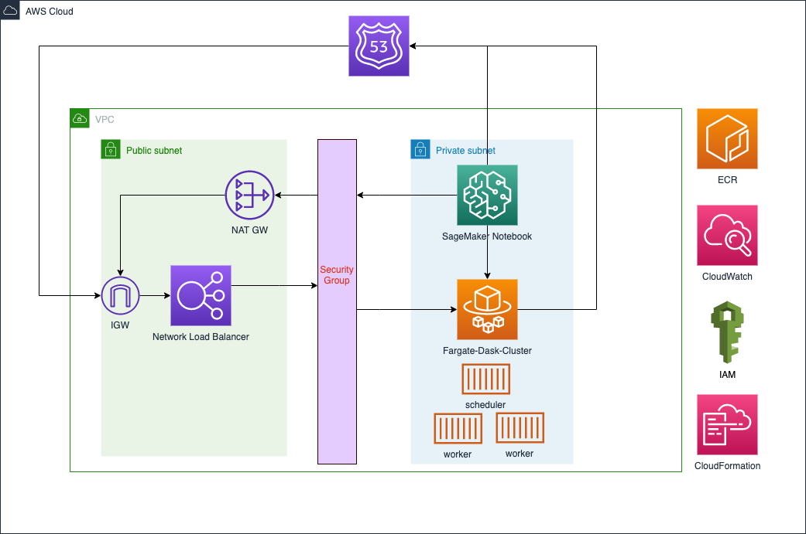

# aws-dask-sm-fargate
Perform data science and ML with Dask on AWS SageMaker and Fargate.

# Architecture

## Implementing Distributed Dask on AWS Fargate

1.  Log into your AWS account and choose your region
2.  Navigate to CloudFormation console and create stack using template source from https://octank-claims-web.s3-us-west-2.amazonaws.com/template/dask-fargate-main.template  

## Setup Network Load Balancer for monitoring Fargate Dask Cluster

1. Navigate to Amazon ECS > Fargate Dask Cluster > Dask Scheduler Service > Tasks and select running task and copy the private IP for the running task
2. Navigate to EC2 > Target Groups and select the dask-scheduler-tg1
3. Select Targets and click Register targets
4. Select dask-vpc-main and add the IP(private IP from step 2) and Ports(8787)  and click button - Include as pending below
5. Wait till targets are registered and then navigate to EC2 > Load Balancers and copy the DNS Name to browser tab to view the Dask Dashboard

   

## Machine Learning using Dask on Fargate - Notebook Overview

1.  Navigate to Amazon ECS > Clusters and ensure Fargate-Dask-Cluster is running with 1 task each for Dask-Scheduler and Dask-Workers
2.  Navigate to Amazon SageMaker > Notebook Instances > Open Jupyter and upload dask-sm-fargate-example.ipynb from this repo
3.  Execute each cell of the notebook and observe the results. See sections below for walkthrough of the notebook.
4.  Use the network load balancer public DNS to monitor the performance of the cluster as you execute the notebook cells.

